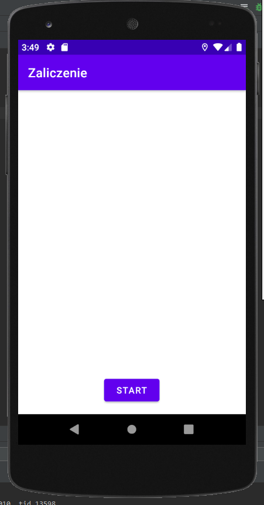
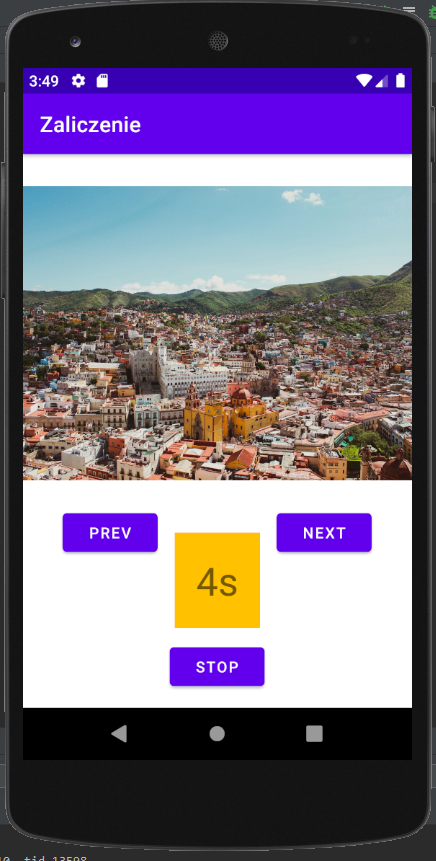

# Aplikacja - odtwarzacz muzyki

## Spis treści
* [Opis aplikacji](#opis-aplikacji)
* [Instrukcja](#instrukcja)
* [Technologie](#technologie)
* [Autorzy](#autorzy)

## Opis aplikacji
Po uruchomieniu aplikacja zaczyna odtwarzać pierwszy utwór, wyświetla obraz utworu oraz zaczyna odliczanie czasu. Możemy przewijać utwory do przodu i do tyłu oraz zatrzymać działanie aplikacji.

## Instrukcja

Kliknij "Start", aby rozpocząć działanie aplikacji

Kliknij "Next", aby przejsć do nastepnego utworu
  Kliknij "Prev", aby przejsć do poprzedniego utworu
Kliknij "Stop", aby zatrzymać działanie aplikacji

## Technologie
* Aplikacja stworzona w środowisku Android Studio
* Napisana w języku Java
* Na urządzenia Android wersja 6.0

## Autorzy
* Kamil Trybel
* Wojciech Iwancz
